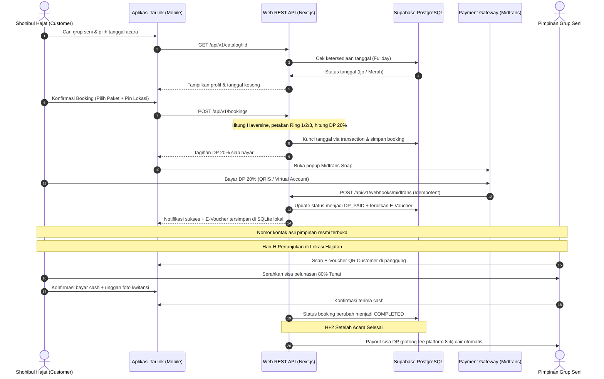

<p align="center">
  
</p>

<h1 align="center">Tarlink</h1>

<p align="center">
  <strong>Platform Marketplace & Booking Digital Seni Pertunjukan Pantura</strong><br>
  <em>Sandiwara Tarling • Dangdut Pantura • Organ Tunggal • Kesenian Tradisional Indramayu & Cirebon</em>
</p>

<p align="center">
  
  
  
  
  
  
  
  
</p>

---


> [!IMPORTANT]
> **Repositori Showcase & Arsitektur Publik:** Repositori ini merupakan etalase publik resmi yang menampilkan dokumentasi, spesifikasi API, dan arsitektur sistem Tarlink. Source code aplikasi mobile, backend Next.js, dan database dikembangkan secara aman di repositori privat internal tim Tarlink. Hubungi pemilik repositori untuk akses kolaborator.

## 📖 Tentang Tarlink

**Tarlink** (*TarlingBook*) adalah platform marketplace digital mandiri yang dirancang khusus untuk ekosistem hiburan rakyat dan seni panggung Pantura (khususnya wilayah Indramayu, Cirebon, Majalengka, Kuningan, dan Subang). 

Tarlink menjembatani **Shohibul Hajat (Tuan Rumah Hajatan / Bu Hajat)** dengan **Pimpinan Sanggar & Lapak Seni (Artis, Dalang, Sandiwara, Organ Tunggal)** secara aman, transparan, terstandardisasi, dan ramah pengguna di pedesaan.

Aplikasi ini mengatasi masalah klasik booking panggung tradisional Pantura:
- ❌ Jadwal bentrok akibat pencatatan manual di buku agenda kertas.
- ❌ Ketidakpastian biaya akomodasi & jarak tempuh antar desa/kecamatan.
- ❌ Risiko pembatalan sepihak tanpa kejelasan uang muka (DP).
- ❌ Kontak langsung yang rawan penipuan atau percaloan tidak resmi.
- ❌ Sinyal internet minim di pedesaan saat Hari-H pertunjukan.

---

## ✨ Fitur Unggulan

### 1. ⚡ Dual-Path Booking (Dua Jalur Pemesanan)
* **Instant Booking (Auto-Accept):** Pesan langsung paket pertunjukan standar layaknya platform travel modern dengan auto-lock kalender dan batas bayar invoice DP 30 menit.
* **Custom Nego (Maksimal 3 Ronde):** Fitur tawar-menawar harga dan durasi pertunjukan dengan batas waktu respon 12 jam per ronde untuk mencegah tawar-menawar tanpa akhir (PHP).
* **Anti-PHP Safeguard:** Maksimal 2 booking kustom berstatus `PENDING` aktif per customer; idle 24 jam otomatis kedaluwarsa.

### 2. 📍 Auto-Hitung Jarak & Biaya Zona (Haversine Formula)
* Jarak dari markas grup (*Basecamp Lat/Lng*) ke lokasi hajatan pemesan (*Venue Lat/Lng*) dihitung otomatis secara presisi di server.
* Biaya akomodasi/zona transportasi dipetakan otomatis:
  * **Zona 1 / Ring 1 (0 – 15 km):** Gratis / Termasuk harga paket dasar.
  * **Zona 2 / Ring 2 (15 – 35 km):** Tambahan transport lokal.
  * **Zona 3 / Ring 3 (> 35 km):** Tambahan transport jarak jauh lintas kabupaten.

### 3. 🔒 Anti Double-Booking (Fullday Mutlak)
* 1 grup seni hanya dapat menerima **1 job aktif per tanggal** (sistem fullday panggung siang-malam).
* Dilindungi oleh *Partial Unique Index* di PostgreSQL:
  ```sql
  CREATE UNIQUE INDEX uniq_artist_date ON bookings(artist_id, event_date)
  WHERE status IN ('DP_PAID', 'PARTIAL_PAID', 'FULL_PAID', 'ONGOING');
  ```

### 4. 🛡️ Anti-Bocor Kontak (Platform Leakage Protection)
* Nomor telepon asli pimpinan grup disamarkan secara default di etalase katalog (`0812-****-**78`).
* Nomor telepon asli hanya dibuka ke pemesan setelah pembayaran DP 20% diverifikasi lunas (`DP_PAID`).

### 5. 💳 Pembayaran Semi-Otomatis (Hybrid Model)
* **DP 20% Online:** Dibayar melalui payment gateway (Midtrans Snap: QRIS, GoPay, Transfer Bank VA) untuk mengikat kepastian jadwal.
* **Pelunasan 80% Tunai di Lokasi:** Dibayar langsung tunai oleh Bu Hajat kepada pimpinan grup pada Hari-H hajatan, kemudian dikonfirmasi dua arah via aplikasi dengan unggahan bukti foto kwitansi fisik.
* **Payout Otomatis H+2:** Sisa dana DP (setelah dipotong fee platform 8%) otomatis dicairkan ke rekening pimpinan grup H+2 setelah acara berstatus `COMPLETED`.

### 6. 🎟️ E-Voucher QR Code dengan Offline Cache (SQLite & Secure Storage)
* E-Voucher bukti pemesanan tersimpan di penyimpanan aman lokal perangkat mobile (`sqflite` & `flutter_secure_storage`).
* Tetap dapat dibuka dan menampilkan kode QR valid di lokasi hajatan pelosok desa tanpa koneksi internet.
* Pimpinan grup dapat memindai QR langsung menggunakan kamera scanner di aplikasi untuk mengubah status ke `ONGOING`.

### 7. 🤖 Floating CS Bot In-App 24/7
* Widget bot bantuan interaktif melayang di sudut layar mobile.
* **Mode 1:** Menjawab FAQ seputar adat hajatan Pantura, jam tayang sandiwara, tata cara DP, hingga bantuan untuk pengguna awam (*asisten gaptek*).
* **Mode 2:** Menangani eskalasi laporan sengketa (*dispute*) yang otomatis mengunci pencairan dana payout (*status DISPUTED*).
* **Mode 3:** Asisten teks pimpinan grup (contoh: *"liburkan tanggal 2026-11-20"*, *"cek saldo"*, *"cek jadwal"*).

### 8. 👥 Multi-Role Terpadu dalam Satu Aplikasi Mobile
* **Customer (Pemesan):** Cari grup, filter tanggal/kota, nego, bayar DP, simpan e-voucher, beri ulasan bintang & foto.
* **Pimpinan Grup Seni:** Buka lapak grup, kelola paket manggung, blokir tanggal kalender manual, scan e-voucher, terima payout.
* **Admin Pasar:** Verifikasi KTP pimpinan grup, investigasi sengketa, pantau payout H+2.

### 9. 🖥️ Web Admin Backoffice & Interactive API Console
* Dashboard web modern Next.js 16 untuk verifikasi KTP seniman, manajemen sengketa, monitoring payout, dan master data wilayah.
* Konsol uji coba API interaktif langsung di `/admin/api-docs`.

---

## 🏗️ Arsitektur Proyek

Sistem dibangun menggunakan **Arsitektur Ramping 2-Tier**: **Mobile Flutter** sebagai client utama pengguna dan **Next.js 16** sebagai server REST API terpadu & Web Admin Backoffice, bertumpu pada **Database PostgreSQL Supabase**:

```text
Sistem/
├── docs/                             # Asset dokumentasi & branding
│   └── tarlink_logo.png              # Logo resmi aplikasi Tarlink
│
├── mobile/                           # Frontend Flutter Mobile App (Multi-Role)
│   ├── android/                      # Native Android config & icons
│   ├── assets/                       # Image assets & placeholder
│   ├── lib/
│   │   ├── core/                     # Tema, networking, utils, widgets
│   │   │   ├── network/              # ApiClient REST, AuthSession
│   │   │   ├── theme/                # Palet Terracotta & Heritage Amber
│   │   │   ├── utils/                # Formatter Rupiah, Haversine, PhoneMasker
│   │   │   └── widgets/              # MainShellScreen, Floating CS Bot, Button, StatusBadge
│   │   ├── features/                 # Modular Feature-First
│   │   │   ├── auth/                 # Login OTP, Register, Profil Pengguna
│   │   │   ├── catalog/              # List artis, filter tanggal/kota, detail lapak, review
│   │   │   ├── booking/              # Form order, instant booking, custom nego, list pesanan
│   │   │   ├── payment/              # Midtrans Snap WebView, konfirmasi cash Hari-H
│   │   │   ├── voucher/              # QR E-Voucher & SQLite offline caching
│   │   │   ├── chat_bot/             # Floating CS bot 24/7 & group chat
│   │   │   ├── profile_group/        # Manajemen lapak sanggar, paket & kalender
│   │   │   ├── admin/                # Panel admin pasar mobile (verifikasi & sengketa)
│   │   │   └── notifications/        # Notifikasi status pemesanan
│   │   └── main.dart                 # Entry point aplikasi Flutter
│   └── test/                         # 36 Unit & Widget Tests (100% Passed)
│
├── web/                              # Unified Backend REST API & Next.js Admin Portal
│   ├── src/app/
│   │   ├── admin/                    # Dashboard Web Backoffice
│   │   │   ├── verifikasi/           # Verifikasi KTP pimpinan sanggar
│   │   │   ├── disputes/             # Mediasi tiket sengketa hajatan
│   │   │   ├── payouts/              # Monitoring pencairan dana H+2
│   │   │   ├── master-data/          # Master kabupaten & kecamatan Pantura
│   │   │   └── api-docs/             # Interactive API Test Console
│   │   ├── api/v1/                   # REST API Endpoints untuk Mobile & Web
│   │   │   ├── catalog/              # Feed katalog artis & detail profil
│   │   │   ├── bookings/             # Pembuatan order & validasi jadwal/zona
│   │   │   ├── bot/                  # Endpoint cerdas CS Bot in-app
│   │   │   ├── webhooks/midtrans/    # Webhook pembayaran DP (idempotent, SHA-512)
│   │   │   └── admin/                # API operasional backoffice
│   │   └── page.tsx                  # Server status & portal landing page
│   ├── src/lib/services/             # TarlinkStore, business rules, Supabase client
│   └── package.json                  # Next.js 16.3 + React 19 + Vitest + Tailwind v4
│
├── supabase/                         # Database Serverless PostgreSQL 15 & DDL
│   ├── migrations/                   # DDL PostgreSQL, RLS Policies, Master Seed Pantura
│   └── functions/                    # Deno / TypeScript Edge Functions
│
├── AGENTS.md                         # Panduan teknis & standar coding agent
└── prd.md                            # Product Requirement Document lengkap (PRD Final v5.0)
```

---

## 🔌 Ringkasan REST API v1 (`web/src/app/api/v1/`)

| Method | Endpoint | Deskripsi | Status Akses |
|---|---|---|---|
| `GET` | `/api/v1/catalog` | Feed katalog grup seni Pantura terverifikasi (nomor HP tersensor). | Publik |
| `GET` | `/api/v1/catalog/:id` | Rincian lengkap profil grup, daftar paket manggung, dan portofolio. | Publik |
| `POST` | `/api/v1/bookings` | Membuat booking baru dengan hitung jarak Haversine, zona logistik, dan DP 20%. | Terotentikasi |
| `POST` | `/api/v1/webhooks/midtrans` | Webhook pembayaran Midtrans (idempotent via `transaction_id`, SHA-512). | Payment Gateway |
| `POST` | `/api/v1/bot` | Mesin in-app CS Bot (FAQ, intake sengketa, asisten gaptek pimpinan). | Publik / Akun |
| `GET` | `/api/v1/admin/stats` | KPI metrik pasar: GMV, pendapatan komisi 8%, sengketa, dan job aktif. | Admin |
| `GET/POST`| `/api/v1/admin/verifications` | Review dan putusan persetujuan/penolakan KTP pimpinan sanggar. | Admin |
| `GET/POST`| `/api/v1/admin/disputes` | Investigasi sengketa dan putusan refund atau pencairan dana. | Admin |
| `GET/POST`| `/api/v1/admin/payouts` | Pantau daftar payout H+2 dan eksekusi retry disbursement. | Admin |

---

## 🔄 Alur Transaksi (Workflow)



---

## 🚀 Panduan Memulai Cepat (Quickstart)

### 1. Prasyarat Sistem
* **Flutter SDK**: `^3.x` (Channel stable) & **Dart SDK**: `^3.x`
* **Node.js**: `v20.x` atau lebih baru & **npm**
* **Android Studio / VS Code** dengan Flutter Extension
* Perangkat fisik Android (USB Debugging aktif) atau Android Emulator

---

### 2. Menjalankan Backend & Web Admin (`/web`)

```bash
# 1. Masuk ke direktori web
cd web

# 2. Instalasi dependensi
npm install

# 3. Jalankan pengujian unit & integrasi API (16 skenario)
npm run test

# 4. Jalankan server lokal Next.js (port 3000)
npm run dev
```
> Buka browser di [http://localhost:3000/admin](http://localhost:3000/admin) untuk mengakses Web Admin Portal, atau [http://localhost:3000/admin/api-docs](http://localhost:3000/admin/api-docs) untuk API Test Console.

---

### 3. Menjalankan Aplikasi Mobile (`/mobile`)

```bash
# 1. Masuk ke direktori mobile
cd ../mobile

# 2. Instalasi dependensi Flutter
flutter pub get

# 3. Jalankan pengujian otomatis (36 skenario unit & widget)
flutter test

# 4. Jalankan aplikasi di Emulator / Smartphone
flutter run
```

---

## 🧪 Status Verifikasi Pengujian (Total 52 Tests)

Seluruh pengujian unit, widget, dan integrasi telah diverifikasi dan berstatus **100% Hijau**:

* **Mobile Flutter (36 Tests Passed):**
  * `haversine_test.dart`: Akurasi kalkulasi jarak antar titik koordinat GPS.
  * `phone_masker_test.dart`: Masking nomor telepon anti-bocor pimpinan grup.
  * `booking_business_rules_test.dart`: Validasi batas custom nego, penentuan zona, dan DP 20%.
  * `catalog_search_test.dart`: Rendering daftar artis dan filter kategori/anggaran.
  * `artist_detail_test.dart`: Rendering profil artis dan parsing paket manggung.
  * `admin_and_review_test.dart`: Validasi putusan sengketa, moderasi lapak, dan ulasan bintang 1–5.
  * `order_confirmation_test.dart`: Alur konfirmasi pemesanan dan blessing Pantura.
* **Web & Backend (16 Tests Passed):**
  * `booking-rules.test.ts`: Uji formula keuangan (DP 20%, fee 8%, sisa 80%, net payout grup).
  * `api-endpoints.test.ts`: Pengujian REST API terpadu (katalog masked, detail artis, anti double-booking 409 conflict, webhook Midtrans idempotent, verifikasi lapak).

---

## 🔐 Keamanan & Integritas Data

1. **Row Level Security (RLS) PostgreSQL:** Setiap entitas pengguna hanya dapat memodifikasi data miliknya sendiri. Akses publik dibatasi hanya untuk katalog artis terverifikasi.
2. **Kalkulasi Finansial Mutlak di Server:** Nominal DP 20%, tarif zona logistik, dan komisi platform 8% dihitung secara mutlak di backend untuk mencegah manipulasi nilai uang dari client mobile.
3. **Idempotency Webhook Pembayaran:** Webhook Midtrans diverifikasi menggunakan hash SHA-512 dan dicatat dengan *idempotency key* berbasis `gateway_trx_id` untuk mencegah pencatatan saldo ganda.
4. **Offline Resilience:** Token dan data tiket disimpan menggunakan enkripsi aman dan database lokal sehingga pengguna di area pelosok minim sinyal tetap dapat menunjukkan bukti booking.

---

## 👥 Tim & Kontribusi

Dibuat dengan dedikasi untuk pelestarian budaya, digitalisasi, dan kemakmuran ekosistem seni panggung Pantura Jawa Barat.

* **Repository:** [https://github.com/rhsa-fr/Tarlink](https://github.com/rhsa-fr/Tarlink)
* **Lisensi:** Hak Cipta Dilindungi Undang-Undang / Closed Source untuk ekosistem Tarlink.

